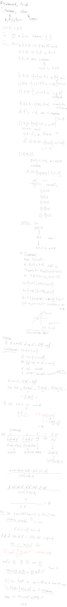
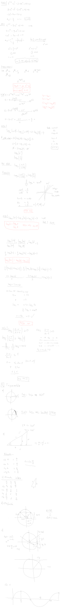
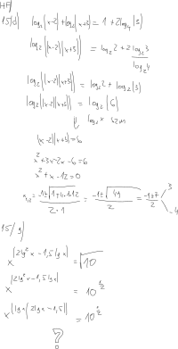
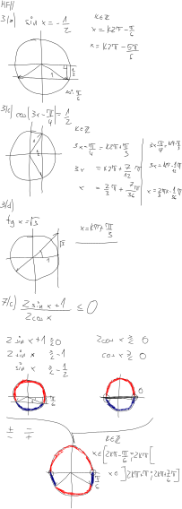

# Matematikai alapok

- 8:15-kor kezdünk
- canvason az anyag
- 3 db zh
    - 90 perc
    - 50 pont összesen
        - 17 pont a minimum
    - 1 db zh-t lehet javítani
        - ha 2 nem sikerül, 1-es jegy
- kis zh-k
    - 10 db
    - canvasban
        - próbazh canvasban
    - 12 perc
    - 4 pont
        - összesen 40 pont
            - minimum 20 pont kell
    - 2025-09-15-én lesz az első

# 1. gyak

# 2. gyak

# 3. gyak

# 4. gyak

# 5. gyak

Addíciós tételeket átnézni

# 6. gyak

## hf

### 4/b

$$\cos{10x} = \cos{2x}$$

1. ugyanaz
    $$ k \in Z$$
    $$10x = 2x + k2\pi$$
    $$8x = k2\pi$$
    $$x = \frac{1}{4}k\pi$$
2. másik oldal
    $$k \in Z$$
    $$10x = -2x + k2\pi$$
    $$12x = k2\pi$$
    $$x = \frac{1}{6}k\pi$$

### 4/c

$$\cos{4x} = \sin{3x}$$
$$\cos{4x} = \cos{\frac{\pi}{2} - 3x}$$

1. ugyanaz
    $$k \in Z$$
    $$4x = \frac{\pi}{2} - 3x + k2\pi$$
    $$7x = k2\pi + \frac{\pi}{2}$$
    $$x = \frac{2}{7}k\pi + \frac{\pi}{14}$$

2. másik oldal
    $$k \in Z$$
    $$4x = -\frac{\pi}{2} + 3x + k2\pi$$
    $$x = k2\pi - \frac{\pi}{2}$$

# 7. gyak

# 8. gyak

